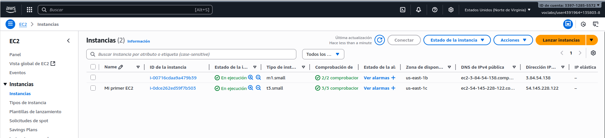
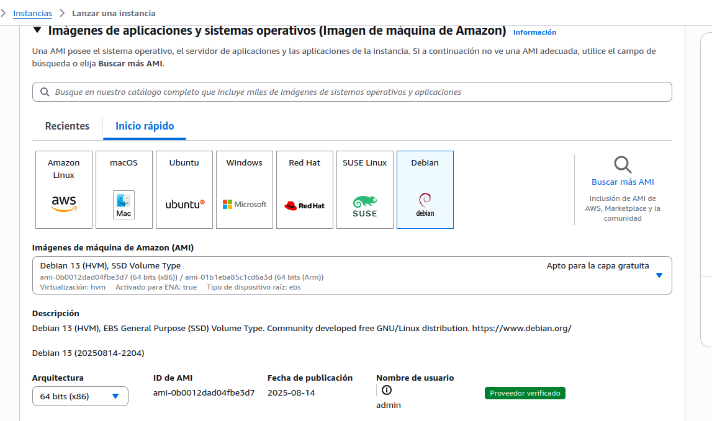
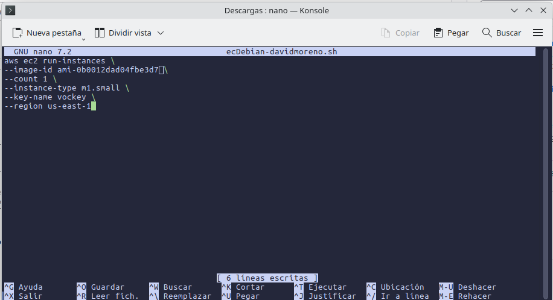
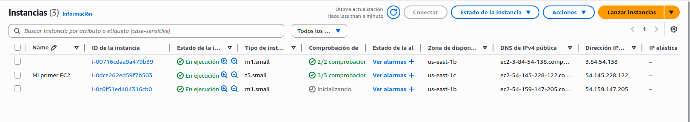
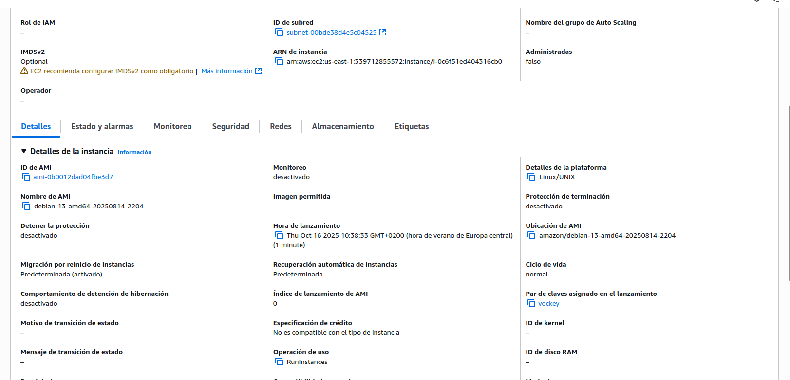

# Ec Debian

### El primer paso es irte al apartado de instancias

### En esta pantalla nos aparece arriba a la derecha lanzar instancia y entraremos en esta pantalla

### En imagenes de maquina de amazon, teniamos de default amazon linux, pues pinchamos en debian, y abajo donde pone *ID de AMI* lo copiamos y lo ponemos en nuestro script para que cuando se ejecute se cree una instancia con Debian.

### Ahora ejecutamos el script con ./*script* y si entramos en niuestras instancias, como en la primera captura saldra esto:

### Lo unico a apreciar en esta captura es ver que la que se acaba de crear con el script se esta inicializando, para comprobar que esta bien, pinchamos al nombre, y tendremos que ver algo como esto:

## DAVID MORENO RODRIGUEZ