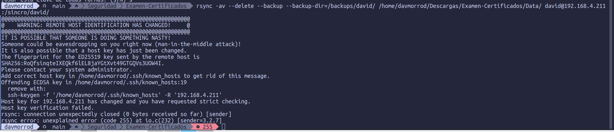

# Prueba Práctica Criptografia

### Para sacar el enunciado de esta tarea simplemente e hecho un --decrypt y he mirado en la carpeta con interfaz grafica y estaba ahi, ya que parece ser que los pdf no los lee bien cuando estan encriptados, o al hacer un cat, porque son imagenes mas que un texto

### Aqui compruebo cual es el mensaje verdadero para saber cual es el zip a descargar

### Aqui hacemos el rsync de el backup y copiar el data entero pero no la carpeta Data

### Para hacer pruebas, borramos un fichero y modificamos otro y volvemos a ejecutar el comando,vemos como el borrado se borra y el modificado se modifica

### Ahora vamos a crear una clave ssh y la vamos a copiar en la ip y usuario que queremos para que no me pida contraseña al hacer el rsync, el cual ejecuta automaticamente un ssh

### Aunque en la captura de arriba se ve como ya no nos pide contraseña, pero para asegurarnos, vamos a volver a borrar un fichero y modificar otro y ejecutar el comando rsync, y ahora vemos como no nos pide contraseña al ejecutar el comando

### Ahora se ve que nuestro profesor a tocado algo y no nos deja hacer el rsync, vamos a solucionarlo y paso seguido explicarlo

### Lo arreglamos copiando el comando que nos pone en el error, donde poner, "remove with: *comando*" y ya nos deja 

## Explicación

### Cuando sucede este error, significa que el propietario de la maquina remota a la que nos queremos conectar, en la cual teniamos una clave ssh para que no nos pida contraseña para por ejemplo hacer un rsync, genera nuevas claves, ya sea por una reinstalacion o rotacion de claves, por eso nos pide con el comando borrar las lineas en las que esta la maquina remota, al borrarlas, ya no tendremos la clave, por lo tanto nos volvera a pedir la contraseña otra vez.

## DAVID MORENO RODRIGUEZ

