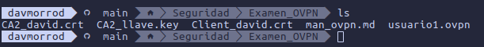

# MANUAL DE OVPN

## Para empezar este manual, extraemos el .zip que nos han pasado, asi consiguiendo los ficheros necesarios para conectarnos a la vpn

## Acto seguido, cuando ya tenemos los ficheros sueltos por la carpeta, la abrimos con terminal, de esta manera

*alt+mayus+F4*

## Ya dentro de la terminal con los ficheros, hacemos ls para comprobar si los tenemos todos



## Aqui vemos como los tenemos, ahora vamos a coger el fichero usuario1.ovpn y vamos a ejecutar el siguiente comando

```bash
sudo openvpn usuario1.ovpn
```

## Esto al ejecutarlo nos preguntaria sobre el usuario y contraseña, el usuario debe saberlo, y despues ya nos pregunta la contraseña del cerfificado, la cual, el usuario tambien deberia de saberla, poniendo esas 3 cosas al ejecutar el comando, ya estariamos dentro de la VPN.


## DAVID MORENO RODRIGUEZ