# UP04 ‑ Prueba práctica ‑ El asalto a la colonia

### En esta primera y segunda imagen lo que hacemos es sacar el hash y con el john y el fichero de contraseñas rockyou.txt, descubrimos la contraseña

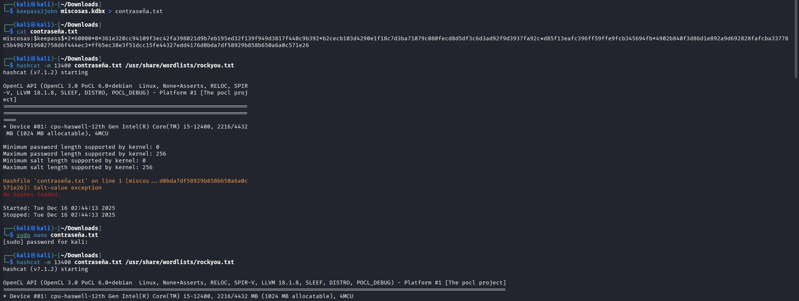

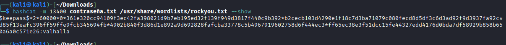

### Dentro del keepass tenemos esta informacion, encontramos la PRIMERA FLAG y tenemos la clave privada, la cual la importamos, tambien tenemos una clave que se utilizara mas tarde, y en otras cosas una url a la cual vamos a entrar

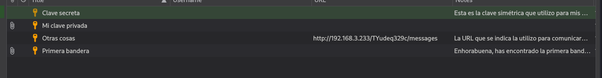

### Dentro de asc tenemos la SEGUNDA FLAG 

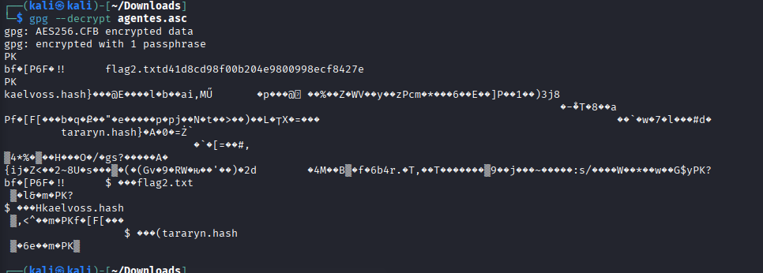

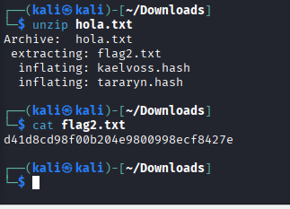

### Aqui tenemos lo que nos salia de la url 

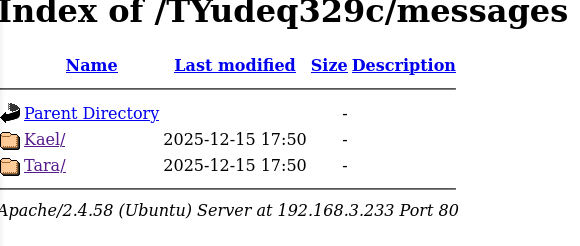

### Aqui tenemos la TERCERA FLAG y nos manda a una url que es de bases

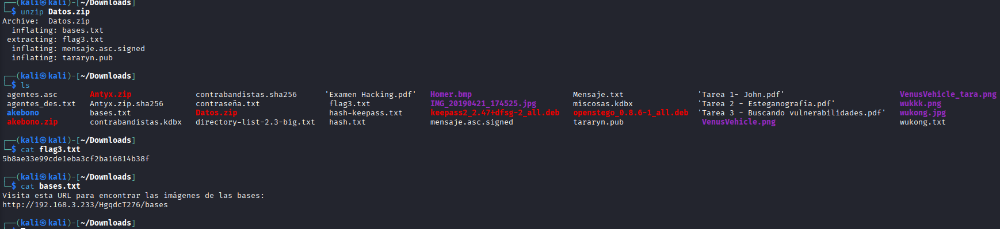

### Extraemos el contenido que nos da en la url

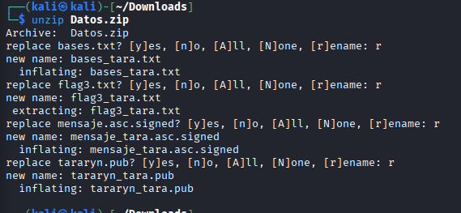

### En el mensaje nos dice esto, asi que vamos a descargar la base2

### Sabemos que no es el falso(tara) porque lo hemos comprobado con los hash

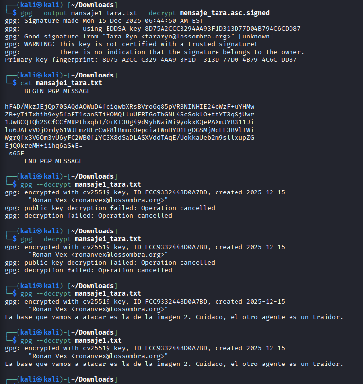

### Para saber el nombre miramos el gps que nos decia al principio de la tarea, el nombre esta en el mensaje encriptado

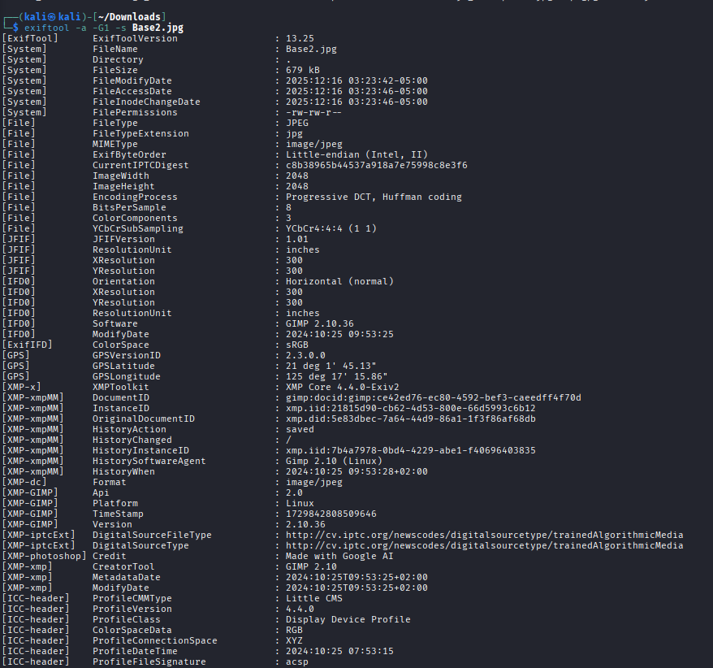

### Encriptamos el mensaje 

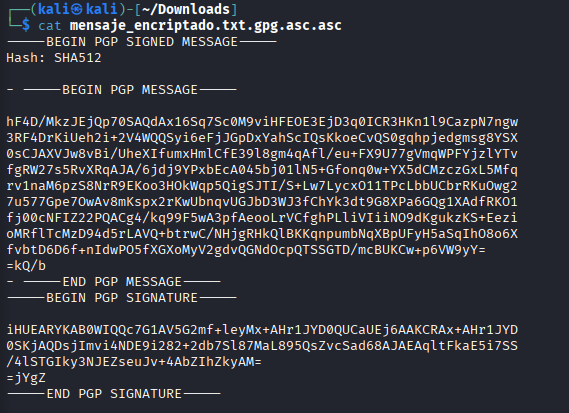

### Buscamos los servicios y puertos abiertos y su OS 

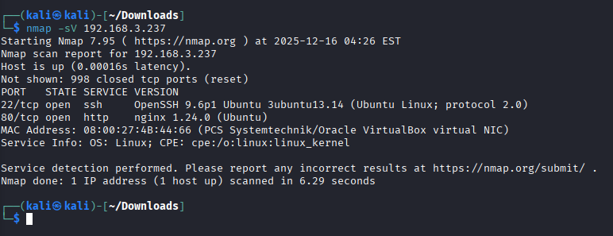

## DAVID MORENO RODRIGUEZ

