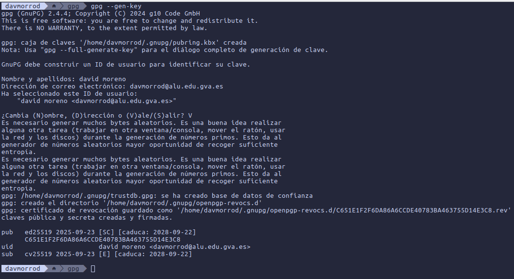
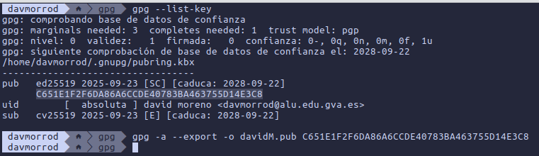
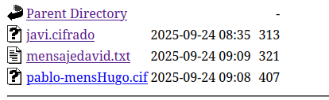
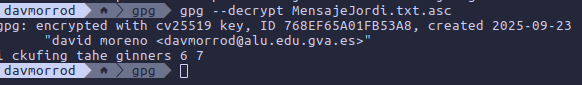
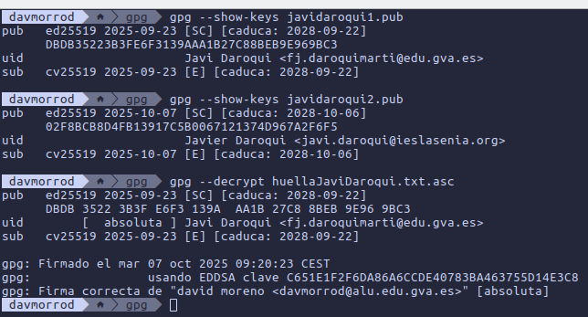
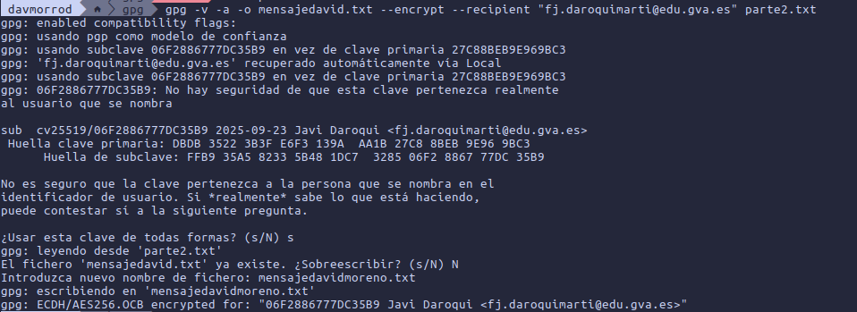
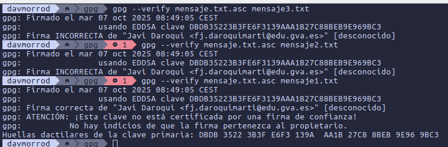
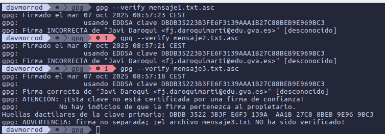
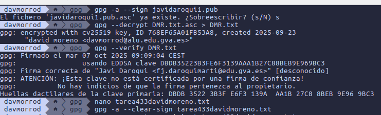
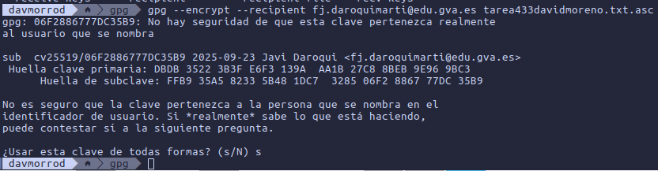

# Criptografía asimétrica

### Creamos la clave publica

### Listamos las claves y la exportamos al propio nombre

### Importamos la clave publica de un compañero y creamos un mensaje en un archivo, este lo encriptamos con el nombre de la clave del compañero en otro fichero

### Lo movemos al directorio de los mensajes

### y por ultimo desencriptamos la el mensaje de un compañero

## Vamos a comprobar cual es la clave correcta de mi profesor y enviarle un mensaje con esta para que vea solo el el mensaje a encriptar un mensaje con su clave

### Aqui vemos como el correo de la clave 2 no es la misma con la que esta encriptado el mensaje que nos da el profesor, por lo tanto es la primera, la cual si que coincide, lo podemos comprobar con el correo o incluso con la ID

### Aqui le escrbimos en parte2.txt un mensaje el cual estara encriptado con a clave del profesor en el archivo mensajedavidmoreno.txt

### Aqui comrobamos cual es el mensaje que no se a modificado despues de su firma, en el fichero .asc esta la firma de mi profesor y en con eso comprobarmos si el fichero que le ponemos despues esta firmado con esta firma, la cual esta firmada con el mensaje1.txt

### Para hacer la clave y la firma en documentos separados se utiliza el comdando gpg -a --detach-sign

### En esta ocasion es lo mismo que arriba pero el el fichero estan dentro la firma y la clave, para saber cual es la buena simplemente utilizamos la opción --verify

### Para hacer que la firma y la clave vayan al mismo fichero, utilizaremos el comando gpg -a --clearsign nombre_fichero

### Firmamos la clave del prfesor y desencriptamos el mensaje a otro fichero, el cual podemos verificar, despues creamos un fichero con un mensaje y lo firmamos para que sea de 1 fichero 

### Ahora el fichero firmado lo encriptamos con la clave del profesor

## DAVID MORENO RODRIGUEZ