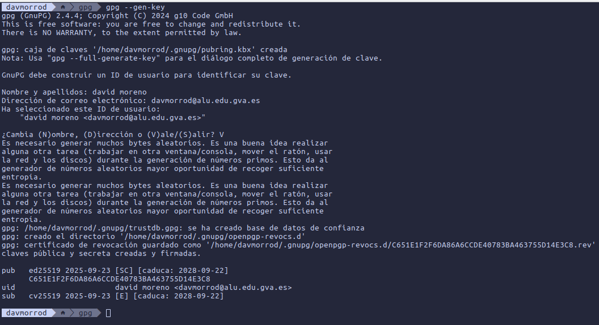
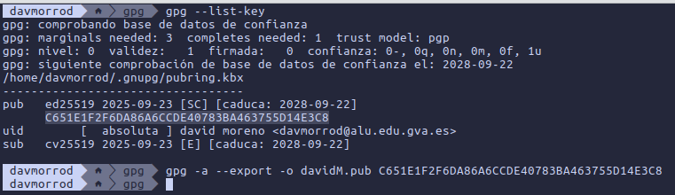
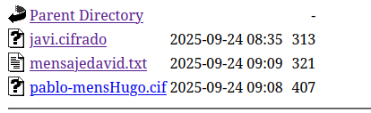
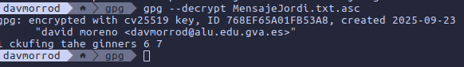

# Criptografía asimétrica

### Creamos la clave publica

### Listamos las claves y la exportamos al propio nombre

### Importamos la clave publica de un compañero y creamos un mensaje en un archivo, este lo encriptamos con el nombre de la clave del compañero en otro fichero

### Lo movemos al directorio de los mensajes

### y por ultimo desencriptamos la el mensaje de un compañero

