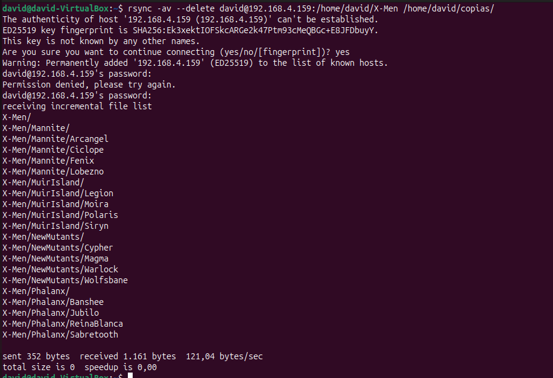
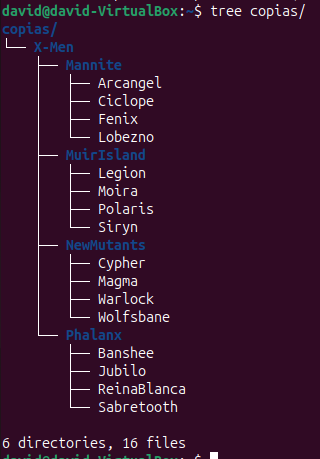
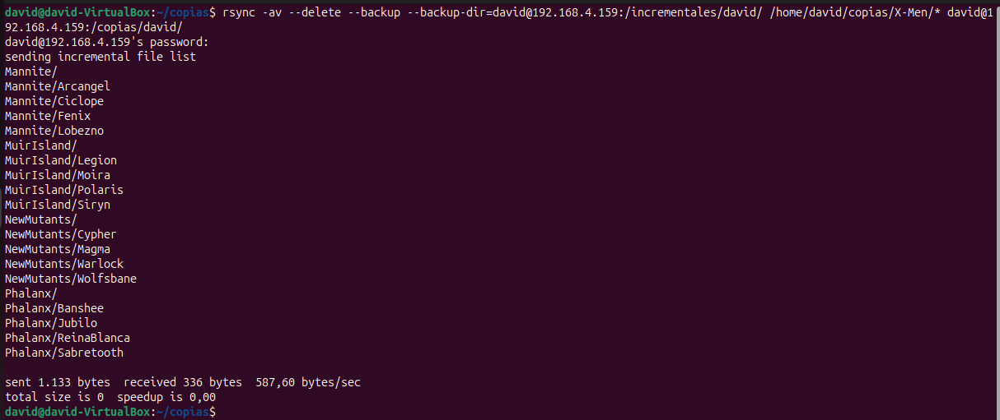
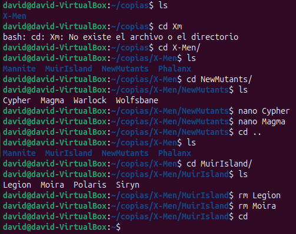
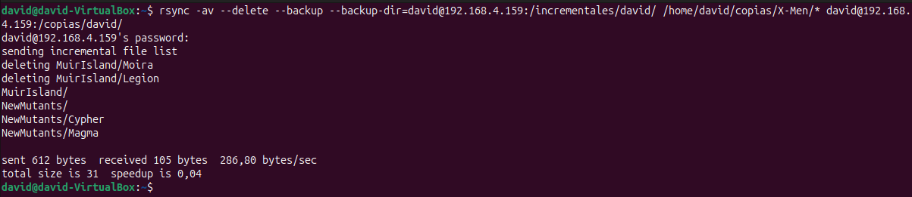

# Prueba Práctica RSYNC

### Hacemos una copia exacta del directorio X-men de la maquina remota a la nuestra 

### Aqui vemos el resultado

### Aqui hacemos una copia exacta del contenido de la carpeta X-men a la carpeta copia de de mi directorio en la maquina remota, y el backup en la carpeta incrementales de mi directorio de la maquina remota

### Aqui cambiamos algunos archivos para volver a ejecutar el comando otra vez y ver los resultados

### Estos son los resultados de los cambios realizados

## DAVID MORENO RODRIGUEZ