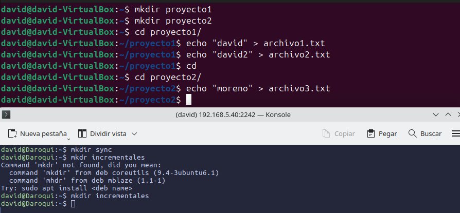
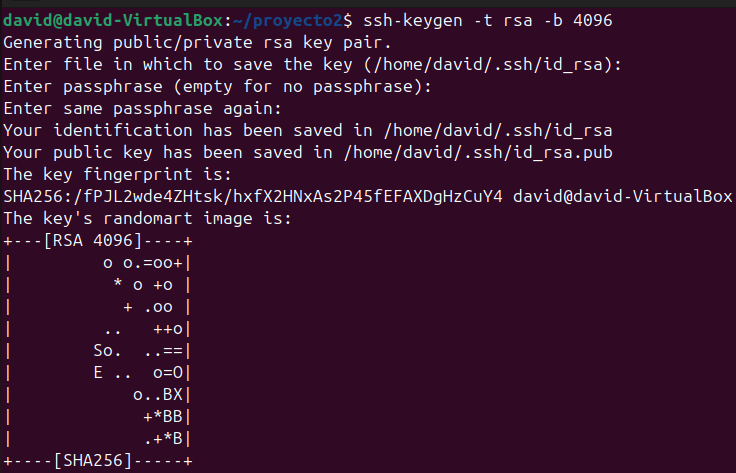
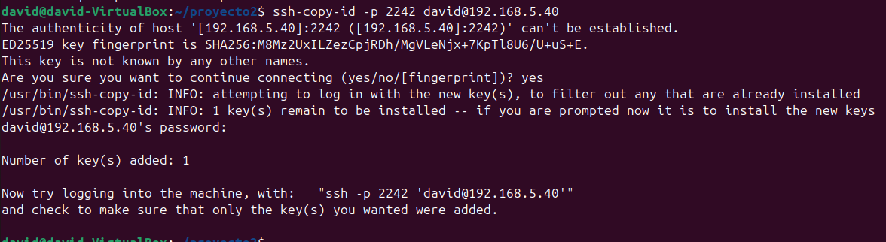
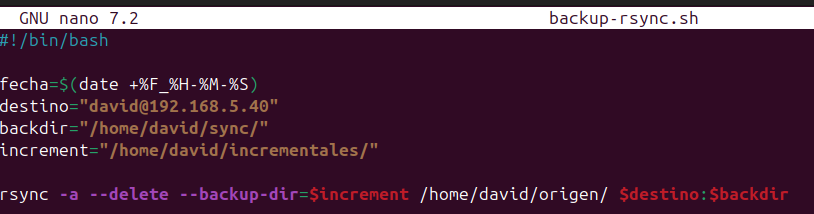
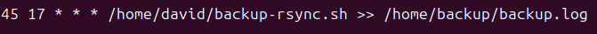
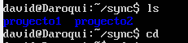
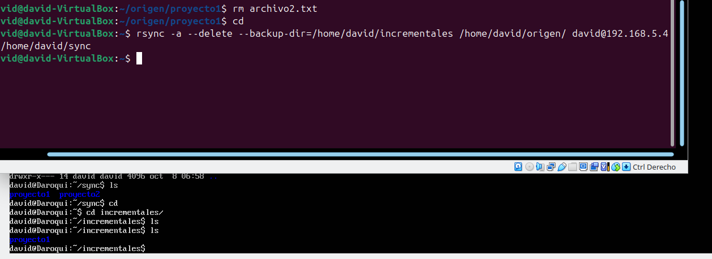

# Criptografía

### Creamos los directorios correspondientes con sus archivos 

### Creamos la clave para que no me tenga que preguntar la contraseña

### Por mi parte he creado un script para que sea mas fácil, en el script simplemente hago lo mismo pero con variables, le tendremos que dar permisos de ejecucion con chmod +x *archivo* 

### Aqui creamos el crontab para que se complete a las 

### Para y probarlo y saber si funciona e cogido la linea y la he ejecutado haciendo algunas pruebas

### Como vemos en estas pruebas, la carpeta de origen se a copiado bien en el directorio sync, vamos a probar a borrar un fichero y volver a ejecutar a ver si se guarda en incrementales

### Como vemos en esta captura, al hacer ls en incrementales no hay nada pero cuando borramos el fichero archivo2.txt y volvemos a ejecutar el comando ya nos sale el proyecto1 y dentro el fichero borrado

## DAVID MORENO RODRIGUEZ