# CLI CON SCRIPT

## SCRIPT COMPLETO

````bash
#!/bin/bash

# Crear VPC y guardar su ID
VPC_ID=$(aws ec2 create-vpc \
  --cidr-block 172.16.0.0/16 \
  --amazon-provided-ipv6-cidr-block \
  --tag-specifications 'ResourceType=vpc,Tags=[{Key=Name,Value=mivpc}]' \
  --query 'Vpc.VpcId' --output text)

echo "VPC ID: $VPC_ID"

# Habilitar DNS en la VPC
aws ec2 modify-vpc-attribute --vpc-id $VPC_ID --enable-dns-hostnames

# Crear Subred y guardar su ID
SUBNET_ID=$(aws ec2 create-subnet \
  --vpc-id $VPC_ID \
  --cidr-block 172.16.0.0/20 \
  --availability-zone us-east-1a \
  --query 'Subnet.SubnetId' --output text)

echo "Subnet ID: $SUBNET_ID"

# Habilitar asignación de IP pública en la subred
aws ec2 modify-subnet-attribute --subnet-id $SUBNET_ID --map-public-ip-on-launch

# Crear grupo de seguridad y guardar su ID
SG_ID=$(aws ec2 create-security-group \
  --vpc-id $VPC_ID \
  --group-name migs \
  --description "Grupo de seguridad para SSH" \
  --query 'GroupId' --output text)

echo "Security Group ID: $SG_ID"

# Abrir el puerto 22 en el grupo de seguridad
aws ec2 authorize-security-group-ingress \
  --group-id $SG_ID \
  --ip-permissions '[{"IpProtocol": "tcp", "FromPort": 22, "ToPort": 22, "IpRanges": [{"CidrIp": "0.0.0.0/0", "Description": "Allow SSH"}]}]'

# Agregar etiqueta al grupo de seguridad
aws ec2 create-tags --resources $SG_ID --tags "Key=Name,Value=migruposeguridad"

# Crear instancia EC2 y guardar su ID
INSTANCE_ID=$(aws ec2 run-instances \
    --image-id ami-0c7217cdde317cfec \
    --instance-type t2.small \
    --key-name vockey \
    --subnet-id $SUBNET_ID \
    --tag-specifications 'ResourceType=instance,Tags=[{Key=Name,Value=tres}]' \
    --private-ip-address 172.16.0.111 \
    --security-group-ids $SG_ID \
    --query 'Instances[0].InstanceId' --output text)

echo "Instance ID: $INSTANCE_ID"


# Crear Internet Gateway y guardar su ID
IGW_ID=$(aws ec2 create-internet-gateway \
  --tag-specifications 'ResourceType=internet-gateway,Tags=[{Key=Name,Value=miigw}]' \
  --query 'InternetGateway.InternetGatewayId' --output text)

echo "Internet Gateway ID: $IGW_ID"

# Adjuntar el IGW a la VPC
aws ec2 attach-internet-gateway --internet-gateway-id $IGW_ID --vpc-id $VPC_ID
echo "IGW adjuntado a la VPC"

# Crear tabla de rutas y guardar su ID
RT_ID=$(aws ec2 create-route-table \
  --vpc-id $VPC_ID \
  --query 'RouteTable.RouteTableId' --output text)

echo "Route Table ID: $RT_ID"

# Agregar una ruta para salida a internet (0.0.0.0/0 -> IGW)
aws ec2 create-route \
  --route-table-id $RT_ID \
  --destination-cidr-block 0.0.0.0/0 \
  --gateway-id $IGW_ID

echo "Ruta por defecto hacia Internet creada"

# Asociar la tabla de rutas a la subred
aws ec2 associate-route-table --subnet-id $SUBNET_ID --route-table-id $RT_ID
echo "Tabla de rutas asociada a la subred"
````

### Volvemos a poner las credenciales que se cambian siempre, y ejecutamos el script

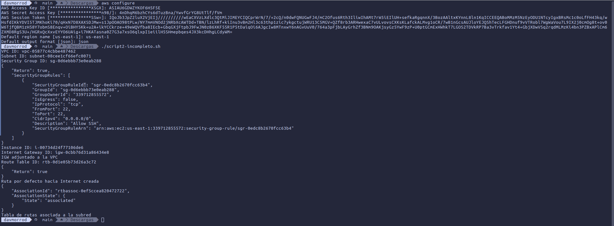

## Ahora vamos a hacer que dos maquinas EC2 se vean aun estando en subredes diferentes

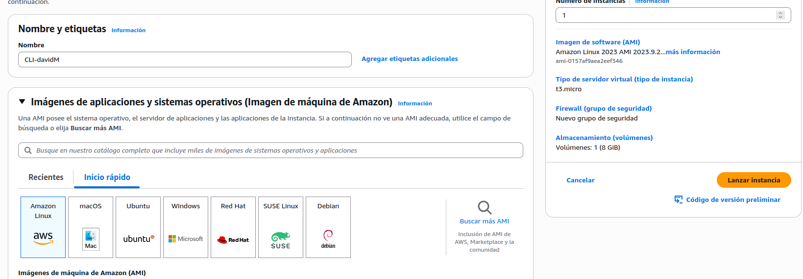

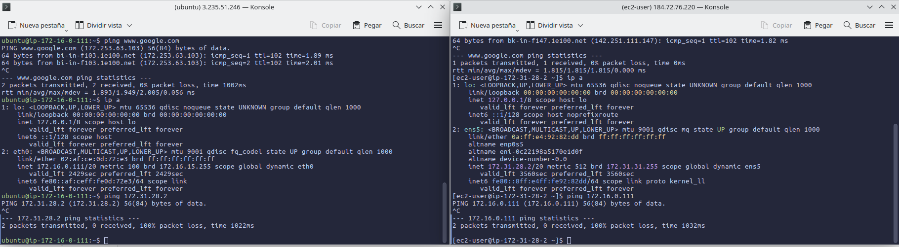

### Aqui creamos la maquina y vemos como no llegan a si mismas

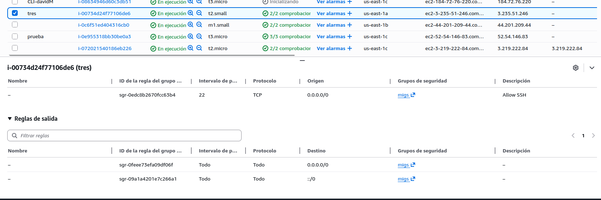

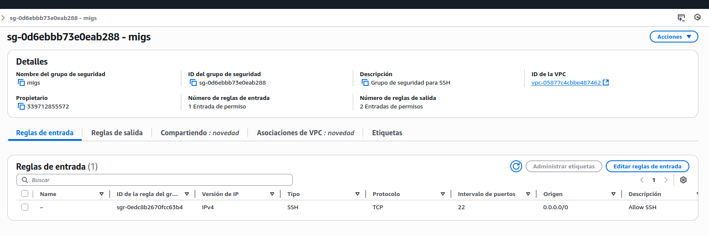

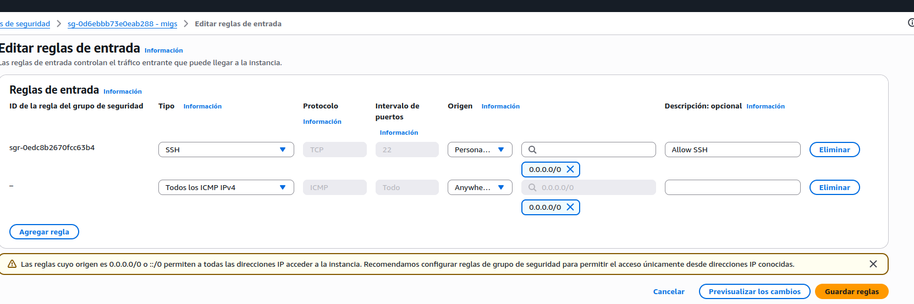

### Aqui creamos el grupo de seguridad el cual tenemos que añadir en la tabla de enrutamiento que permita el protocolo ICMP para todo

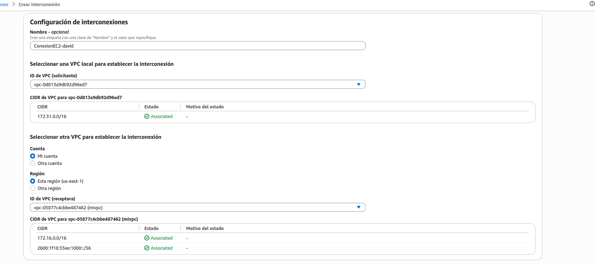

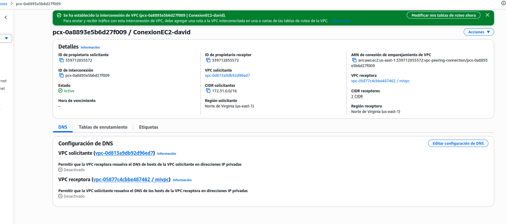

### Establecemos la conexion entre las dos maquinas mediante una interconexion

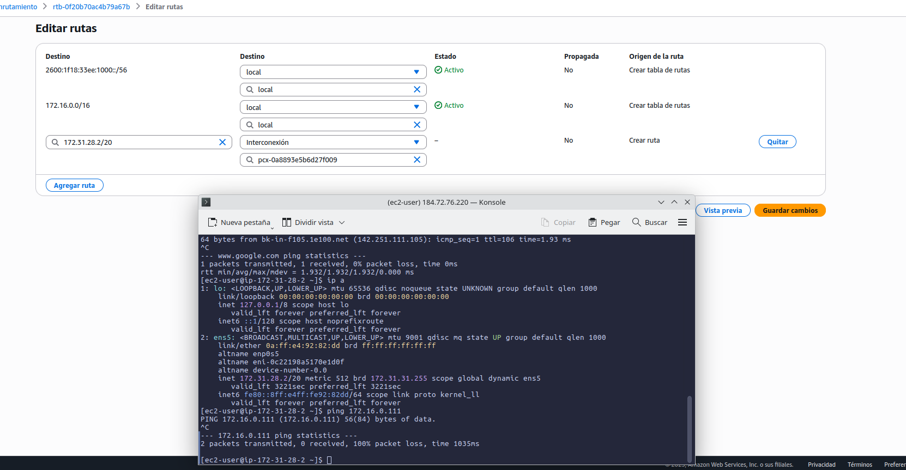

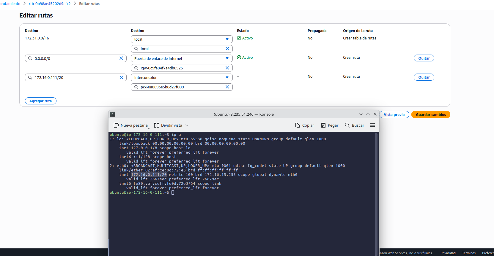

### Ahora añadimos la rutas de interconexion a cada maquina

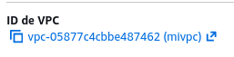

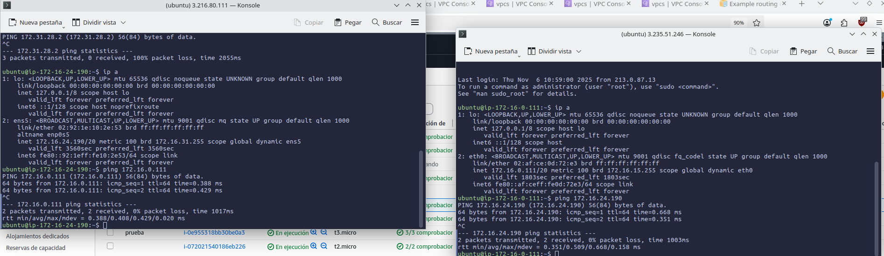

### Tienen que tener la misma VPC pero en diferente subred, ahora vemos en la captura como ya llegan entre si

## DAVID MORENO RODRIGUEZ
