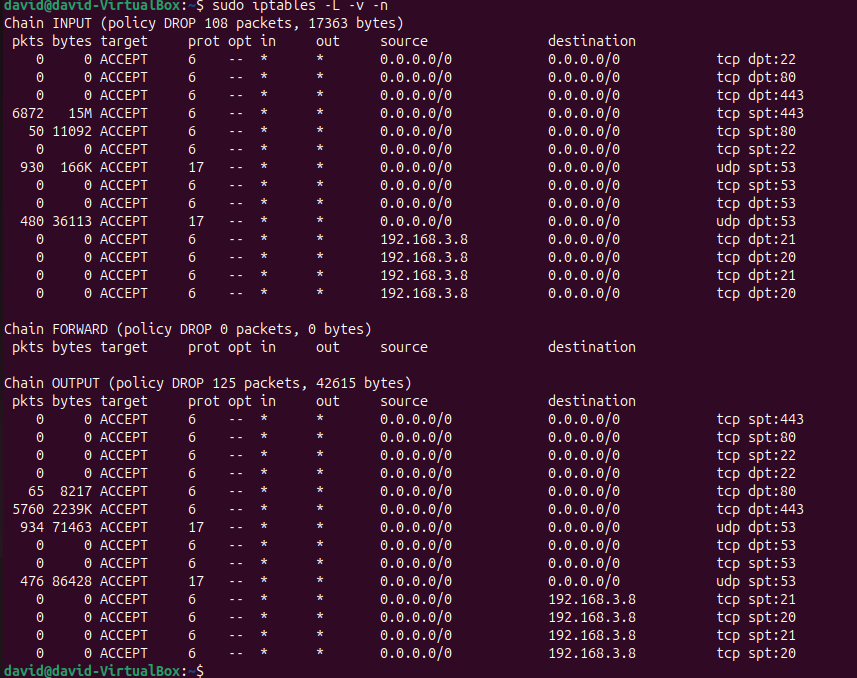
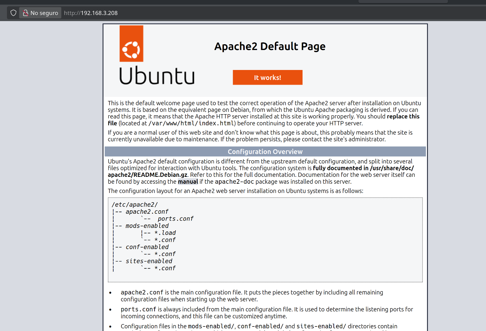

# Tarea 1 – Retos de cortafuegos básico

### Asi es como tendria que quedar, vamos a ver que hemos ejecutado para que quede asi

## Vamos a hacer todo con politica DROP

### Limpiamos la reglas 

iptables -F
iptables -X
iptables -t nat -F
iptables -t nat -X
iptables -t mangle -F
iptables -t mangle -X

### Comprobamos que tenemos todo instalado

sudo apt update
sudo apt install nmap
sudo apt update
sudo apt install apache2 openssh-server

### Aqui vemos como nos funciona perfectamente el apache

### Permitir tráfico entrante desde el compañero
iptables -A INPUT -s 192.168.3.8 -j ACCEPT

### Permitir respuestas al compañero
iptables -A OUTPUT -d 192.168.3.8 -j ACCEPT

### SSH
iptables -A INPUT -p tcp --dport 22 -j ACCEPT
iptables -A INPUT -p tcp --sport 22 -j ACCEPT

iptables -A OUTPUT -p tcp --dport 22 -j ACCEPT
iptables -A OUTPUT -p tcp --sport 22 -j ACCEPT

### HTTP y HTTPS
iptables -A INPUT -p tcp --dport 80 -j ACCEPT
iptables -A INPUT -p tcp --dport 443 -j ACCEPT
iptables -A INPUT -p tcp --sport 80 -j ACCEPT
iptables -A INPUT -p tcp --sport 443 -j ACCEPT

iptables -A OUTPUT -p tcp --dport 80 -j ACCEPT
iptables -A OUTPUT -p tcp --dport 443 -j ACCEPT
iptables -A OUTPUT -p tcp --sport 80 -j ACCEPT
iptables -A OUTPUT -p tcp --sport 443 -j ACCEPT

### Permitimos el Ping

iptables -A INPUT -s 192.168.3.8 -p icmp --icmp-type 8 -j ACCEPT
iptables -A OUTPUT -d 192.168.3.8 -p icmp --icmp-type 0 -j ACCEPT

### Permitimos el DNS

iptables -A INPUT -p udp ACCEPT
iptables -A OUTPUT -p udp -j ACCEPT

iptables -A INPUT -p tcp ACCEPT
iptables -A OUTPUT -p tcp -j ACCEPT

### Activamos e instalamos el ftp

sudo apt install vsftpd
sudo systemctl start vsftpd

### Permitimos el puerto 21 y 20

iptables -A INPUT -s 192.168.3.8 -p tcp --dport 21 -j ACCEPT
iptables -A OUTPUT -d 192.168.3.8 -p tcp --sport 21 -j ACCEPT

iptables -A INPUT -s 192.168.3.8 -p tcp --sport 21 -j ACCEPT
iptables -A OUTPUT -d 192.168.3.8 -p tcp --dport 21 -j ACCEPT

iptables -A INPUT -s 192.168.3.8 -p tcp --dport 20 -j ACCEPT
iptables -A OUTPUT -d 192.168.3.8 -p tcp --sport 20 -j ACCEPT

iptables -A INPUT -s 192.168.3.8 -p tcp --sport 20 -j ACCEPT
iptables -A OUTPUT -d 192.168.3.8 -p tcp --dport 20 -j ACCEPT

### Para que se queden las iptables despues de reiniciar, ejecutamos esto

sudo apt install iptables-persistent
sudo netfilter-persistent save

## DAVID MORENO RODRIGUEZ