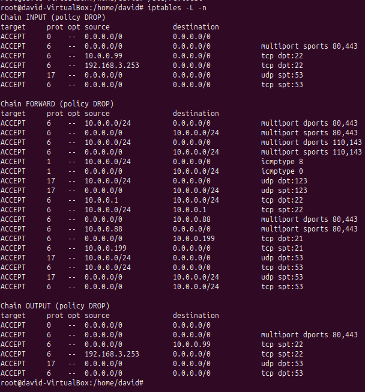

# Tarea 2 – Firewall entre redes

#!/bin/bash

iptables -F # Borra todas las reglas
iptables -t nat -F # Borra todas las reglas de la tabla NAT
iptables -X # Elimina cadenas

#Convertimos la politica por defecto en DROP
iptables -P INPUT DROP

iptables -P OUTPUT DROP

iptables -P FORWARD DROP

iptables -A INPUT -i lo -j ACCEPT # Permite trafico entrante por loopback
iptables -A OUTPUT -o lo -j ACCEPT # Permite trafico saliente por lookpback

#Esta regla facilita las cosas ya que no hace falta poner respuestas en la reglas, pero por ahora no se pueden usar
#iptables -A INPUT -m conntrack --ctstate ESTABLISHED,RELATED -j ACCEPT # Permite paquetes de conexiones ya establecidas o relacionadas hacie el firewall
#iptables -A OUTPUT -m conntrack --ctstate ESTABLISHED,RELATED -j ACCEPT # Permite respuestas dl firewall a coneciones ya establecidas
#iptables -A FORWARD -m conntrack --ctstate ESTABLISHED,RELATED -j ACCEPT # Permite respuestas a conexiones que atraviesan el firewall

iptables -t nat -A POSTROUTING -s 10.0.0.0/24 -o enp0s3 -j MASQUERADE # El masquerade

iptables -A FORWARD -s 10.0.0.0/24 -o enp0s3 -p tcp -m multiport --dports 80,443 -j ACCEPT #Permite navegar por el puerto 80 y 443
iptables -A FORWARD -d 10.0.0.0/24 -i enp0s3 -p tcp -m multiport --sports 80,443 -j ACCEPT

iptables -A INPUT -p tcp -m multiport --sports 80,443 -j ACCEPT
iptables -A OUTPUT -p tcp -m multiport --dports 80,443 -j ACCEPT

iptables -A FORWARD -s 10.0.0.0/24 -o enp0s3 -p tcp -m multiport --dports 110,143 -j ACCEPT # Permite consultar el correo
iptables -A FORWARD -d 10.0.0.0/24 -i enp0s3 -p tcp -m multiport --sports 110,143 -j ACCEPT

iptables -A FORWARD -s 10.0.0.0/24 -o enp0s3 -p icmp --icmp-type echo-request -j ACCEPT # Para que puedan hacer ping
iptables -A FORWARD -d 10.0.0.0/24 -i enp0s3 -p icmp --icmp-type echo-reply -j ACCEPT

iptables -A FORWARD -s 10.0.0.0/24 -o enp0s3 -p udp --dport 123 -j ACCEPT # Permite consultar servidores de hora NTP
iptables -A FORWARD -d 10.0.0.0/24 -i enp0s3 -p udp --sport 123 -j ACCEPT

iptables -A INPUT -s 10.0.0.99 -p tcp --dport 22 -j ACCEPT # Permite al admin conectarse por ssh al firewall
iptables -A OUTPUT -d 10.0.0.99 -p tcp --sport 22 -j ACCEPT

iptables -A INPUT -s 192.168.3.253 -p tcp --dport 22 -j ACCEPT # Permite al profe acceder por ssh por su ip publica al firewall
iptables -A OUTPUT -s 192.168.3.253 -p tcp --sport 22 -j ACCEPT

iptables -A FORWARD -s 10.0.0.1 -d 10.0.0.0/24 -p tcp --dport 22 -j ACCEPT # Permite al admin acceder por ssh desde internet a los equipos
iptables -A FORWARD -d 10.0.0.1 -s 10.0.0.0/24 -p tcp --sport 22 -j ACCEPT

iptables -t nat -A PREROUTING -i enp0s3 -p tcp -m multiport --dports 80,443 -j DNAT --to-destination 10.0.0.88 # Redirige las conexiones web al webserver interno

iptables -A FORWARD -d 10.0.0.88 -p tcp -m multiport --dports 80,443 -j ACCEPT # Permite el paso del trafico web hacia el webserver
iptables -A FORWARD -s 10.0.0.88 -p tcp -m multiport --sports 80,443 -j ACCEPT

iptables -t nat -A PREROUTING -i enp0s3 -p tcp --dport 21 -j DNAT --to-destination 10.0.0.199 # Redirige las conexiones FTP entrantes al servidor FTP

iptables -A FORWARD -d 10.0.0.199 -p tcp --dport 21 -j ACCEPT # Permite el acceso FTP al servidor interno
iptables -A FORWARD -s 10.0.0.199 -p tcp --sport 21 -j ACCEPT

#Lo comento porque en realidad en esta tarea no hace falta esta regla ya que en webserver no le hace falta consultar con el firewall para llegar a la base de datos, eso lo veremos con la DMZ
#iptables -A FORWARD -s 10.0.0.88 -d 10.0.0.200 -p tcp --dport 3306 -j ACCEPT # Permite al webserver conectarse al servidor de base de datos
#iptables -A FORWARD -d 10.0.0.88 -s 10.0.0.200 -p tcp --sport 3306 -j ACCEPT

iptables -A OUTPUT -p udp --dport 53 -j ACCEPT # DNS
iptables -A INPUT -p udp --sport 53 -j ACCEPT
iptables -A OUTPUT -p tcp --dport 53 -j ACCEPT
iptables -A INPUT -p tcp --sport 53 -j ACCEPT

#Accedemos a web
iptables -A FORWARD -s 10.0.0.0/24 -o enp0s3 -p udp --dport 53 -j ACCEPT
iptables -A FORWARD -s 10.0.0.0/24 -o enp0s3 -p tcp --dport 53 -j ACCEPT
iptables -A FORWARD -d 10.0.0.0/24 -i enp0s3 -p udp --sport 53 -j ACCEPT
iptables -A FORWARD -d 10.0.0.0/24 -i enp0s3 -p tcp --sport 53 -j ACCEPT