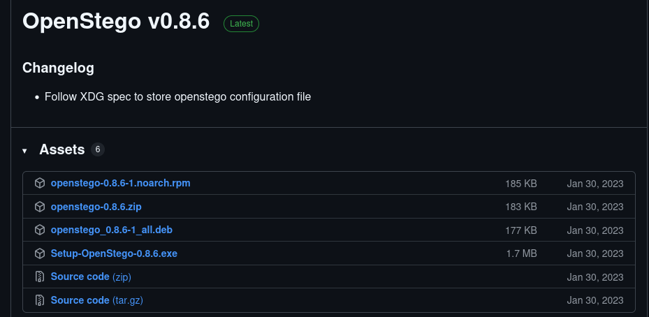
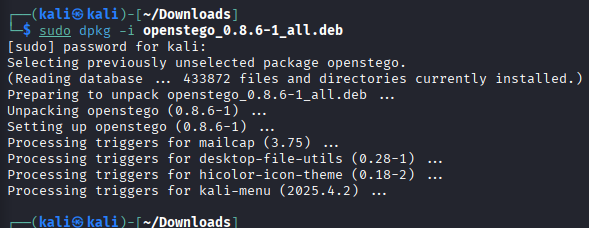
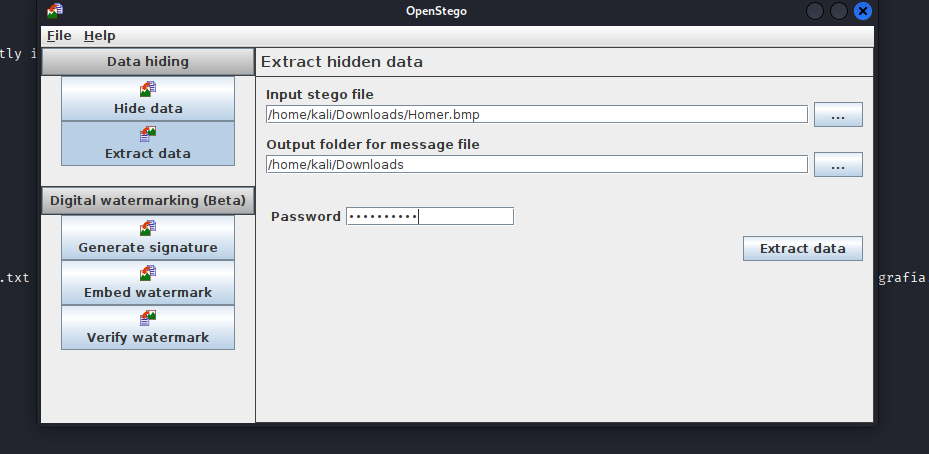
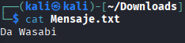
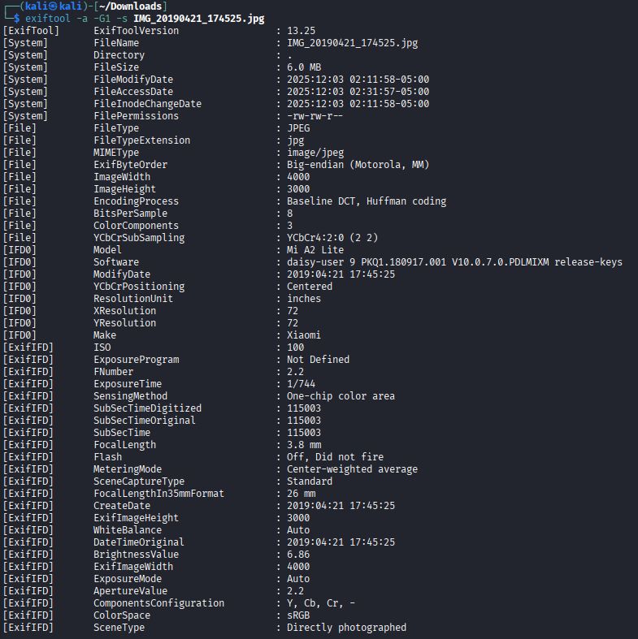
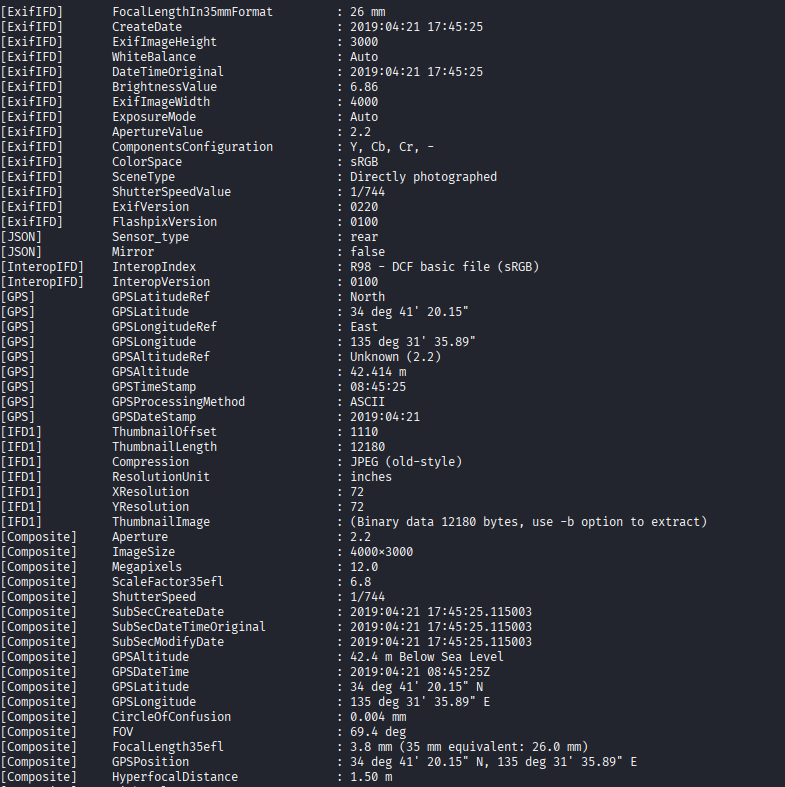
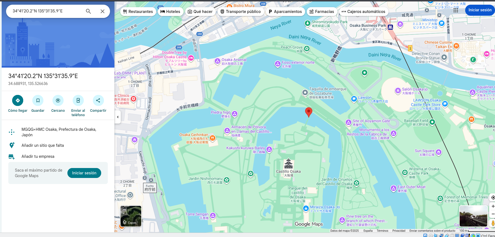

# Esteganografía

### Empezamos descargando el fichero que acaba en .deb

### Instalamos lo instalado con dpkh -i

### Aqui tenemos que poner extract data ya que estamos extrayendo mensajes que pueda tener la foto seleccionada, a un directorio en el cual el openstego nos pondra el nombre predeterminado, que es Mensaje.txt

### Le hacemos un cat al fichero que ha creado el stego y ya vemos elmensaje

---

### Para ver toda la informacion de la imagen seleccionada introducimos este comando

### En estas imagenes si nos fijamos vemos informacion como filename el nombre del fichero, filemodifydate que es la ultima vez que se a modificado esa foto, y abajo del todo sale GPSposition que es la ubicacion en la cual se hizo la foto, vamos a buscar esa ubicacion en google maos

### Aqui vemos la posicion de desde donde se hizo la imagen, que es en Osaka, Japón

## DAVID MORENO RODRIGUEZ