# JOHN THE RIPPER

### El primer paso sera verificar si los hash coinciden para comprobar de que no este corrupto

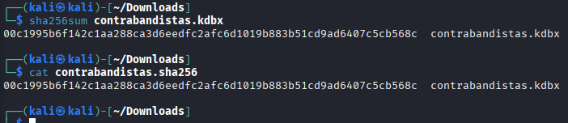

### Le pasamos la contraseña maestro con este comando a un fichero nuevo
### Cabe recalcar que a este nuevo fichero lo modificaremos y le quitaremos el nombre que tiene en la primera palabra, ya que no es normal pero en algunas situaciones suele dar fallos depende de la situación, lo guardamos con otro nombre para saber que es el bueno, en mi caso se llamara *hash.txt*

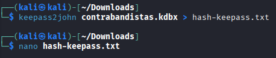

### Aqui descomprimimos el rockyou, que tiene muchas posibles contraseñas, lo utilizaremos ahora

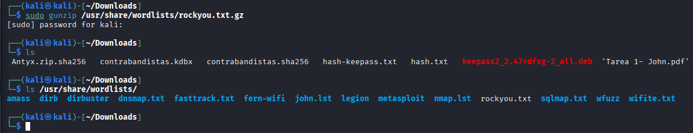

### Esto lo que hace es intentar encontrar la contraseña maestro con el diccionario de contraseñas rockyou

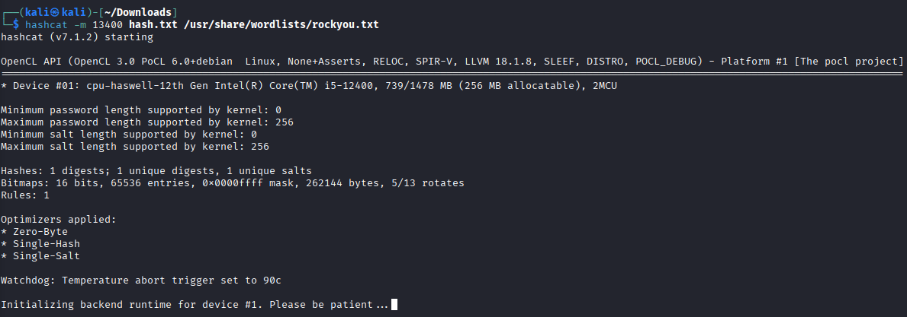

### Aqui vemos como se a crackeado la contraseña y nos dice cual es, en este caso es mindgame, abrimos el keepassXC con ese comando y nos sale esta pagina, metemos la contraseña, en este caso mindgame

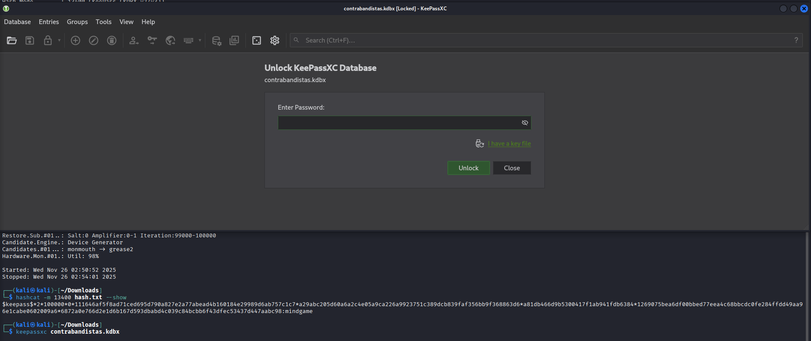

### Y nos sale esto, vamos a disco duro, y copiamos la url y pegamos en el navegador, y nos instalara un VDI, este tiene que ser una maquina nueva, pero como no sabemos nada del usuario y contraseña, vamos a añadirle el vdi como secundario a nuestra maquina para encontrar informacion

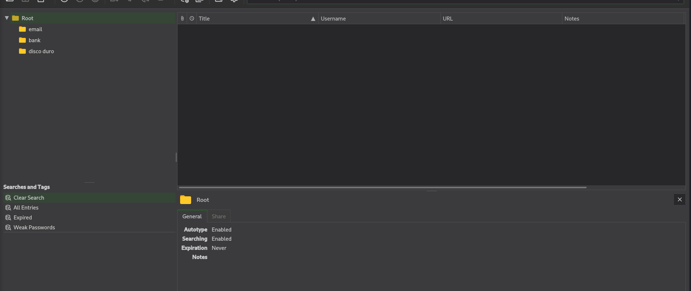

### Aqui vemos que ya lo tenemos, es el de 80GB

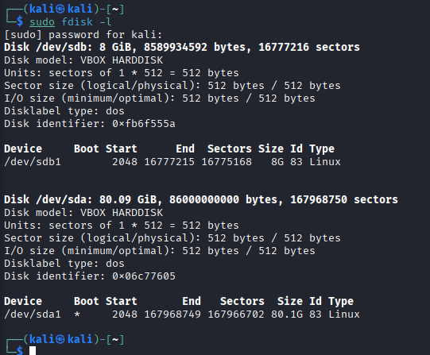

### Creamos el directorio donde vamos a montar la particion del disco, y nos pasamos el passw y el shadow, en el cual estan los usuarios y contraseñas a nuestro home con una carpeta nueva para poder trabajar mas ordenado

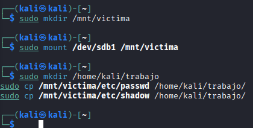

### Le hacemos un unshadow a los dos ficheros, esto hace que se cree un fichero con los usuarios y contraseñas de estos dos, como vemos en la captura, hace falta entrar en root

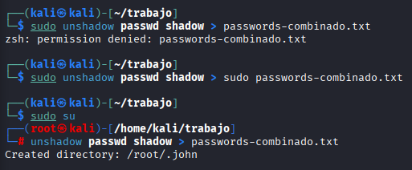

### Esto nos da solo los usuarios, vamos a conseguir las contraseñas tambien

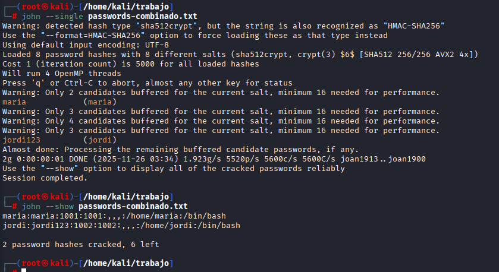

### Con este comando ya tendriamos la contraseña, y los usuarios

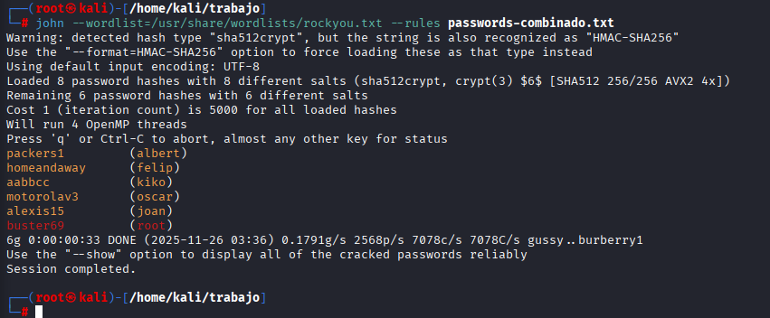

### Ahora si paramos la maquina y vamos a la maquina del vdi que hemos instalado, al poner por ejemplo, kiko y su contraseña aabbcc, deberia de dejarnos entrar, vamos a comprobarlo

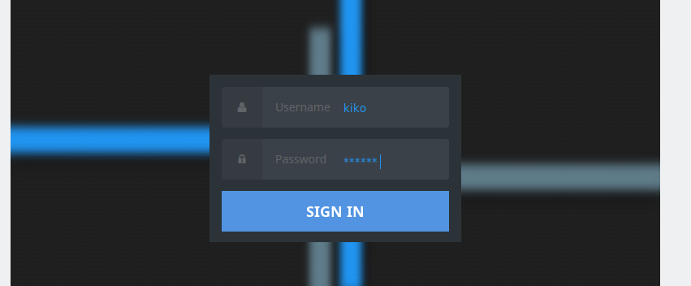

### Ponemos las contraseñas, y ya estamos dentro.

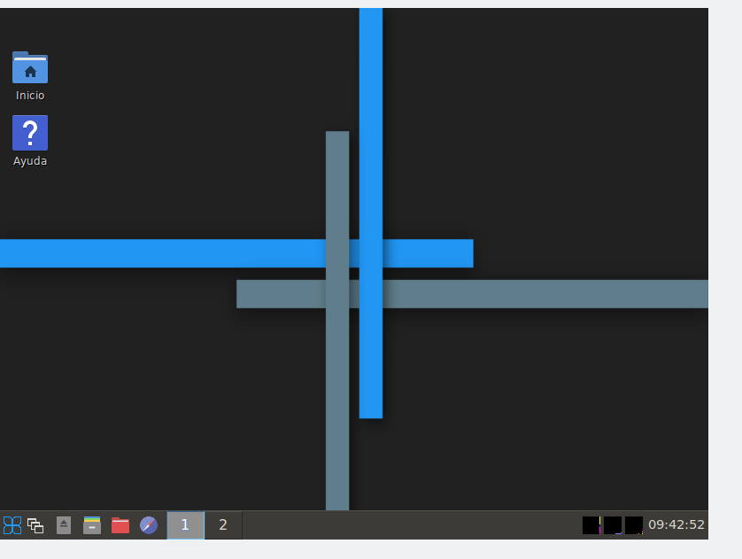

## DAVID MORENO RODRIGUEZ

