# SUMO 

### Encontramos como hemos hecho en la practica anterios que puertos tiene abiertos, como hemos visto el 80, vamos a entrar por ahi, vemos que hay estos directorios

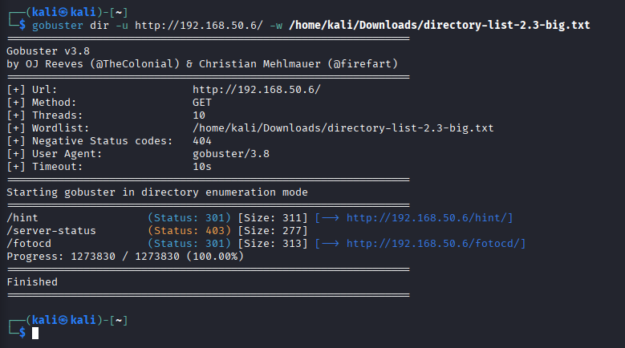

### Entramos en el hint y vemos en el codigo fuente que hay algo escondido, vamos a desecriptarlo

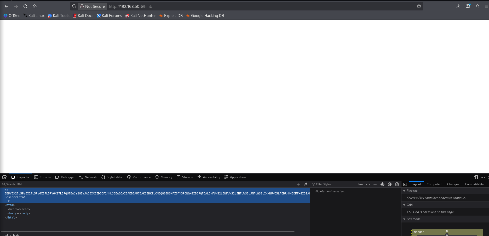

### Esto dice

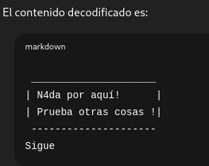

### Entramos en el fotocd y vemos esto que buscamos y sabemos que es un brainfuck

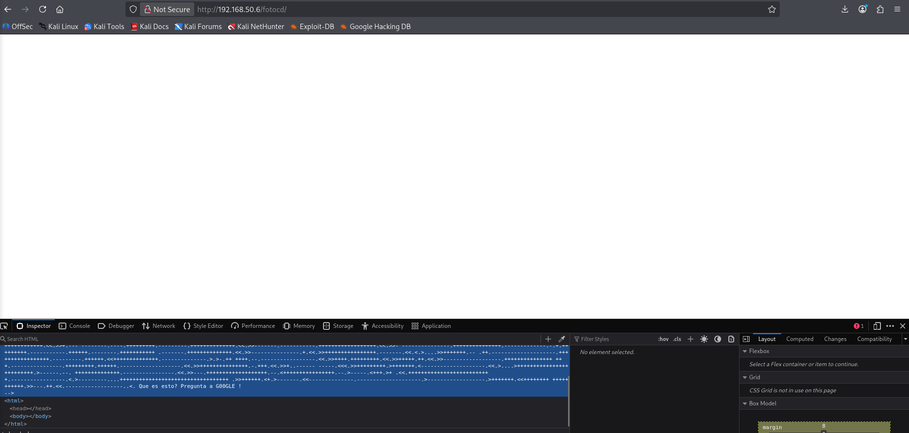

### Aqui encontramos que ficheros hay escondidos, vemos que hay uno que se llama entry.js, que sera el usuario

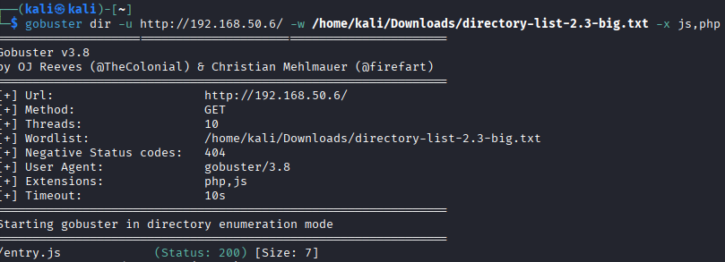

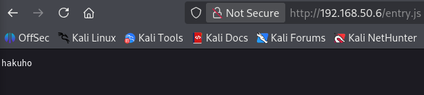

### Aqui esta la traduccion del brainfuck, vemos que esta encriptado, en base 32

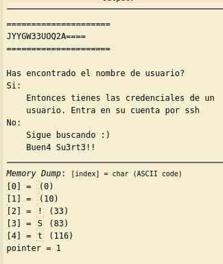

### Lo desecriptamos y nos da la contraseña del usuario de arriba

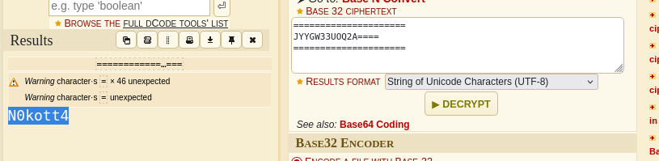

### Entramos y vemos que hemos conseguido la primera bandera, y el fichero .zip que nos da esta ruta en el http

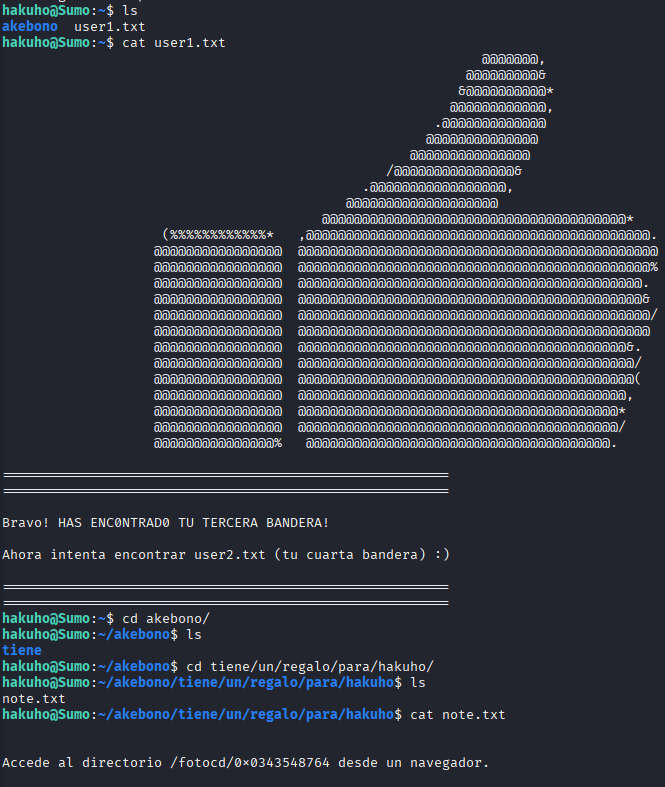

### Le pasamos el .zip a john porque tiene contraseña, y la averiguamos 

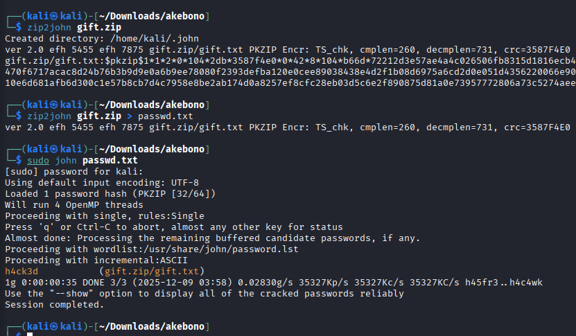

### Esto es lo que hay dentro del zip

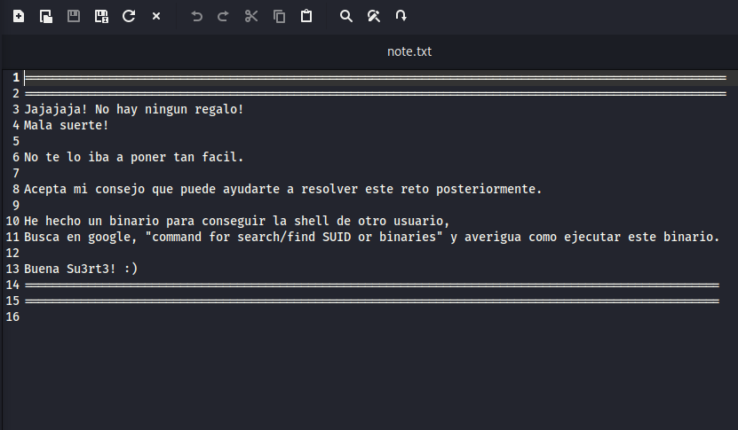

### Encontramos los ficheros que tienen permisos para que podamos entrar

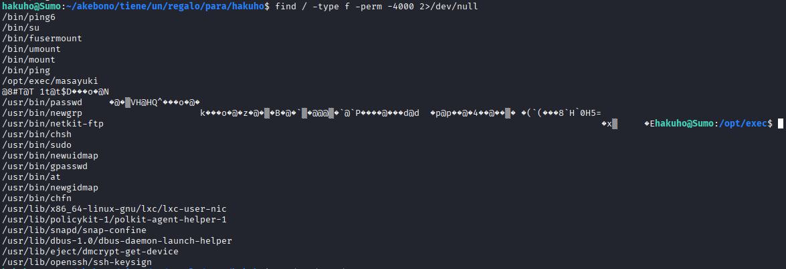

### Entramos dentro de masayuki y vemos esto que tenemos

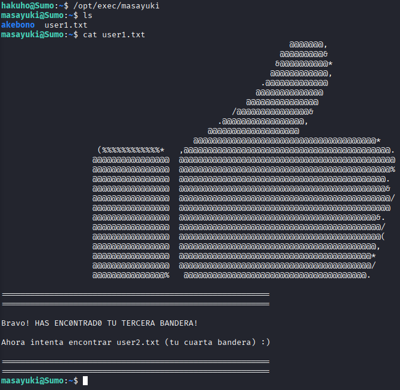

## Encontramos el fichero user2.txt de esta manera

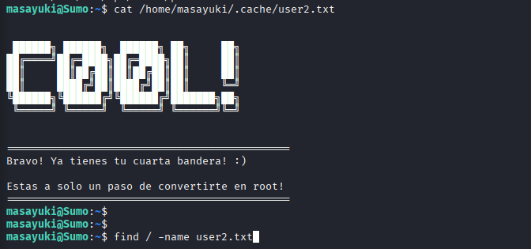

### Tambien encontramos este fichero note.txt

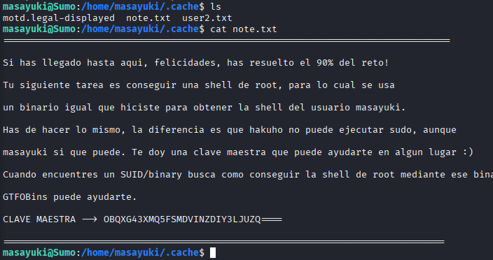

### Pasamos a base 32 y vemos que esta es la contraseña de masayuki

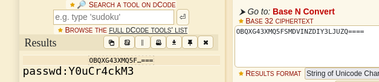

### Ya podemos entrar dentro de masayuki

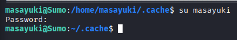

### Entramos dentro de ftp que tiene permisos de sudo, y ya dentro entramos en una shell que es root, y ya podemos entrar en la carpeta de root que es lo que nos pedia y vemos el txt que nos dice que nos hemos pasado el juego al encontrar la ultima bandera

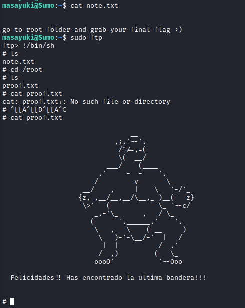

## DAVID MORENO RODRIGUEZ

