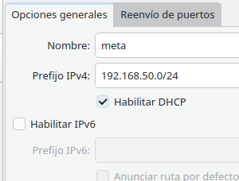
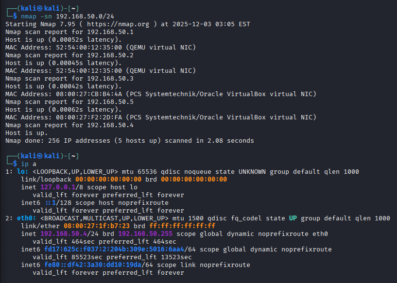
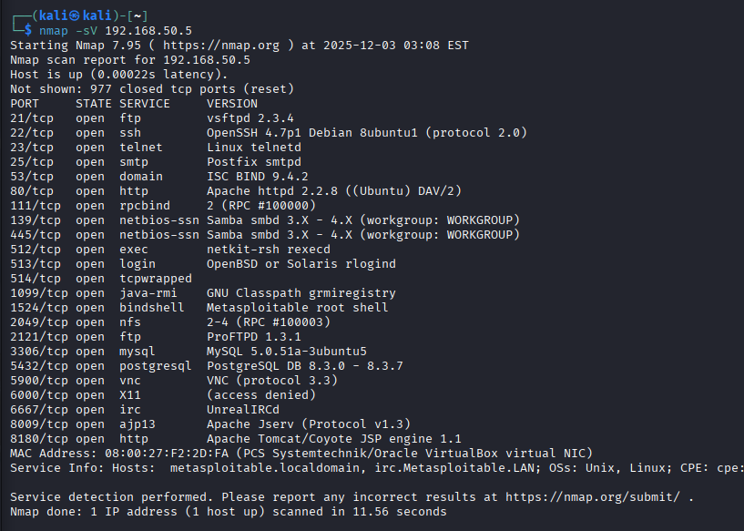
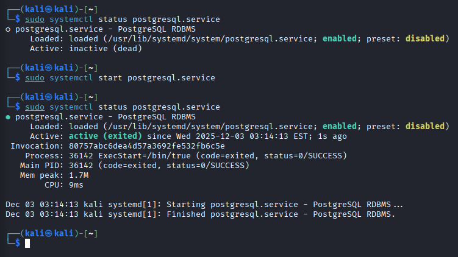
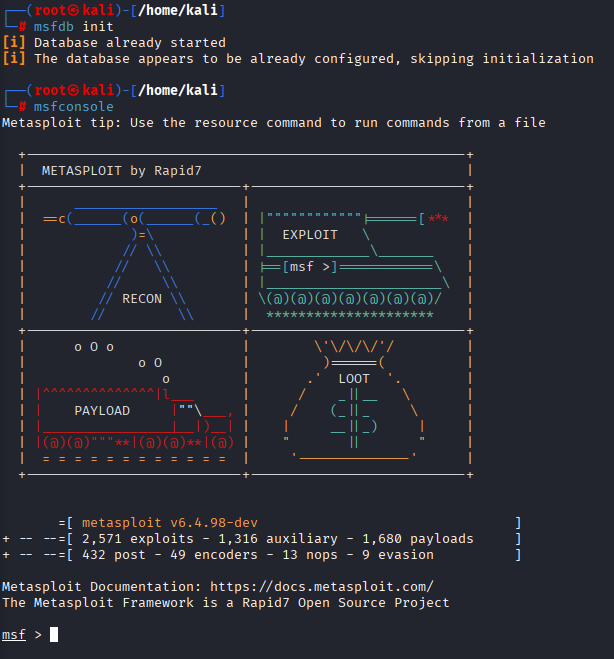
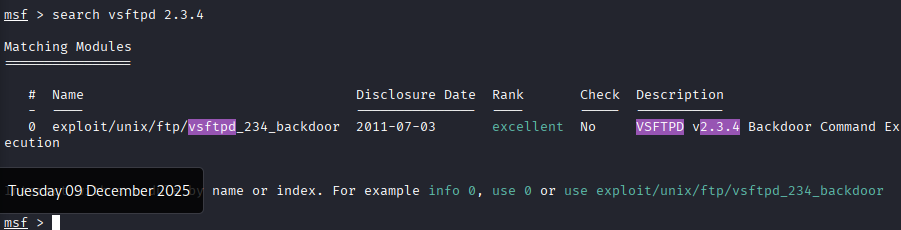
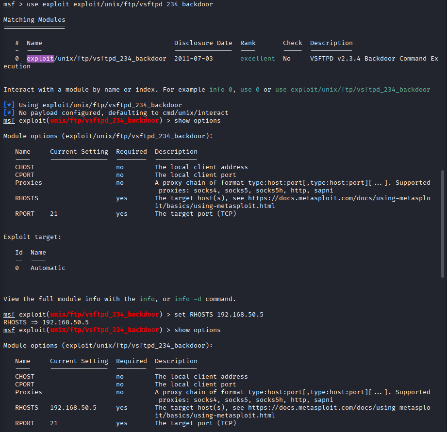
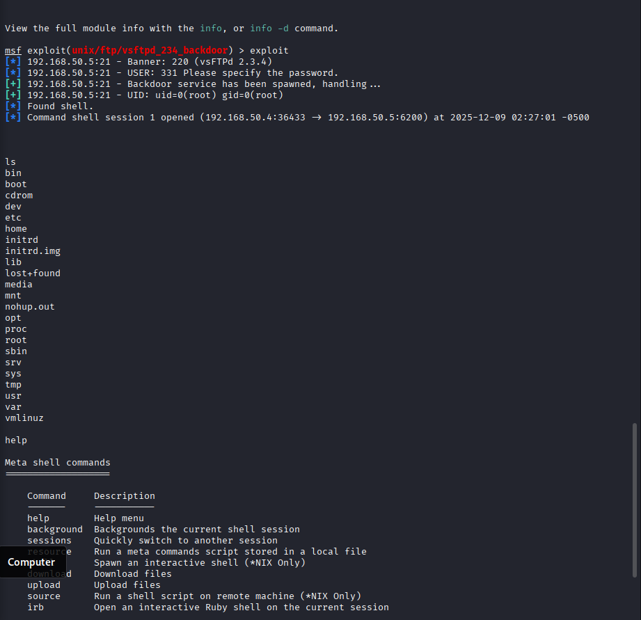
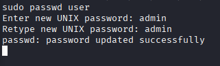
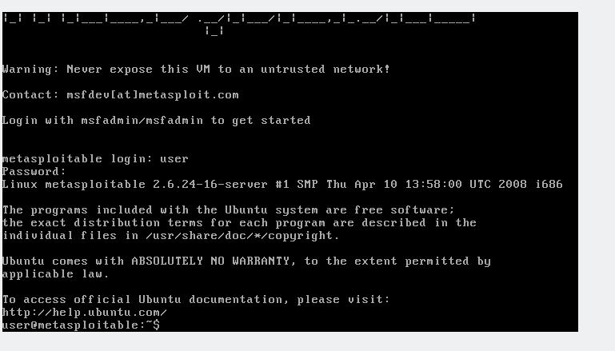

# Buscando vulnerabilidades

### Creamos una red nat como esta en la que vamos a poner las dos maquinas, la kali y la metasploitable

### Ahora ya que estamos en la misma red, vamos a ejecutar un nmap para saber que ip's tengo en mi red y su informacion, por ejemplo en esta captura vemos como hay dos virtual box, sabemos que la .4 es la nuestra porque es la ip que tenemos asi que ya sabemos que la maquina metasploitable es la .5

### Como ya sabemos esta ip vamos a ejecutar nmap para ver que puertos tiene abiertos y sus versiones

### Ahora vemos como estaba inactivo y lo activamos con un start

### Aqui entramos con la herramienta metasploit

### Aqui buscamos cualquier sevicio que tenga abierto la maquina, en nuestro caso tiene bastantes, ya lo hemos visto arriba, en este caso vamos a entrar a vsftpd, por la version que tiene la otra maquina

### Con la ruta que nos da, usamos el exploit y entramos en una terminal que nos deja hacer cosas, esas que tenemos en la captura, vamos a cambiarle el RHOSTS

### Al poner la ip de la otra maquina que ya la conociamos, ya podemos ejecutar, run o exploit y entrariamos dentro de una terminal que enseña muy poco pero lo necesario para poder ver cosas como los directorios o los usuarios y contraseñas o cambiarlas

### Con el comando cat /etc/passwd encontramos los nombres de usuario de todo el sistema, sabemos que podemos entrar si tiene /home/[usuario], hemos visto que hay uno que se llama user asi que vamos a cambiarle la contraseña para poder entrar en la maquina con este usuario, vamos a ponerle la contraseña *admin*

### Aqui ya vemos que hemos podido entrar con el usuario y contraseña que le hemos indicado antes

## DAVID MORENO RODRIGUEZ