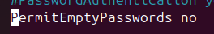
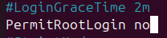
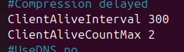
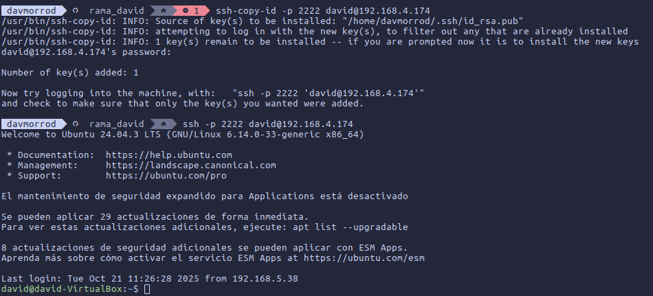

# Tarea 4 SSH

### Instalamos ssh con el siguiente comando:

````bash
sudo apt install openssh-server
````

### • Deshabilitar passwords en blanco



### • Cambiar el puerto por defecto


### • Deshabilitar el login de root a través de ssh



### • Deshabilitar el protocolo 1 de ssh

### Esta opcion no esta por defecto, no hace falta deshabilitarla

### • Configurar un intervalo de inactividad de la sesión



### • Permitir el acceso únicamente a ciertos usuarios


### Con el contenido del fichero ssh que esta en github, podemos crear una clave, pasarsela al servidor, y despues conectarnos al servidor sin contraseña, ya que tiene nuestra clave publica



